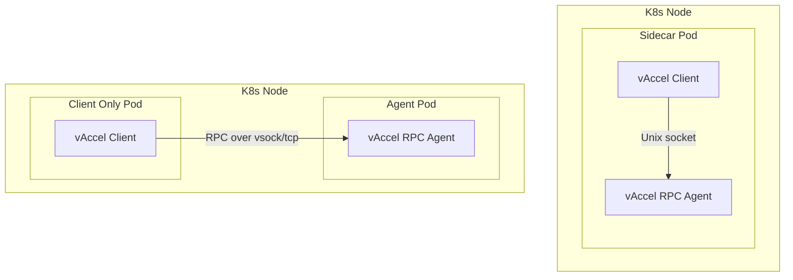

# Deploying vAccel applications using Kubernetes

This guide describes how to deploy a **vAccel**-enabled application, alongside
the **vAccel Agent** with the Torch plugin using Kubernetes. It includes:

- Full explanation of the deployment architecture
- Sidecar-based co-location of client and agent
- Split deployment with remote agent access
- Dockerfiles for both client and agent
- Simple block diagram for visual reference

## Architecture Overview

The deployment includes:

- The **vAccel Agent** (running `vaccel-rpc-agent`) exposing a Unix socket or TCP
  endpoint.
- The **vAccel**-enabled Application, packaged with the RPC plugin, which
  connects to the agent.
- A sidecar option to colocate both agent and client in one pod for
  latency-sensitive workloads.
- A split deployment option where the agent runs as a standalone DaemonSet.

## Deployment Graph



This repo holds all the necessary files to deploy a vAccel application in a k8s cluster.

```console
├── docker
│   ├── Dockerfile
│   └── Dockerfile.agent
├── manifests
│   ├── client.yaml
│   ├── daemonset-agent.yaml
│   └── sidecar.yaml
└── README.md
```

In the `docker` folder we include two `Dockerfiles`, one for the client
application and one for the vaccel agent. Feel free to build on the client
`Dockerfile` to create your own. To showcase our example we have already
included our application binary in an example container image:
`harbor.nbfc.io/nubificus/vaccel-torch-bert-example:x86_64`.

The `manifests` folder contains YAML files to deploy this example in both modes
of operation.

### Dataset

We use the following dataset: 

Get it from
[here](https://raw.githubusercontent.com/priyanshkedia04/Tweets-Classification-among-Hate-Speech-Offensive-Neither/refs/heads/master/data.csv).
Based on the manifests you will have to place it accordingly to
`/data/tweets.txt` or `/tmp/data/tweets.txt`

### vAccel Agent as a **sidecar** container

The agent runs alongside the client application, in a single pod
(`sidecar.yaml`). Since this mode implicitly assumes that both containers
share the same mount namespaces, we can use the `UNIX` socket RPC transport.
See the following snippet from the YAML file:

```YAML
    containers:
        - name: vaccel-agent
          volumeMounts:
              - name: vaccel-sock
                mountPath: /var/run/vaccel
...
        - name: vaccel-client
...
          volumeMounts:
              - name: vaccel-sock
                mountPath: /var/run/vaccel
...
    volumes:
        - name: vaccel-sock
          emptyDir: {}
```

> Note: The `ENTRYPOINT` of the Agent's Dockerfile is the following:

```Dockerfile
ENTRYPOINT ["vaccel-rpc-agent", "-a", "unix:///var/run/vaccel/vaccel.sock"]
```

> and the env var that points to the
> vAccel endpoint in the Client's Dockerfile is:

```Dockerfile
ENV VACCEL_RPC_ADDRESS="unix:///var/run/vaccel/vaccel.sock"
```


Logs from an example deployment are shown below.

Agent logs, before the client start:

```console
$ kubectl logs vaccel-sidecar-pod -c vaccel-agent
[2025-06-22T22:30:03Z INFO  ttrpc::sync::server] server listen started
[2025-06-22T22:30:03Z INFO  ttrpc::sync::server] server started
[2025-06-22T22:30:03Z INFO  vaccel_rpc_agent] vAccel RPC agent started
[2025-06-22T22:30:03Z INFO  vaccel_rpc_agent] Listening on 'unix:///var/run/vaccel/vaccel.sock', press Ctrl+C to exit
```

Client logs:

```console
$ kubectl logs vaccel-sidecar-pod -c vaccel-client
2025.06.22-22:30:03.73 - <info> vAccel 0.7.0-7-e67e52b6
2025.06.22-22:30:03.73 - <info> Registered plugin rpc 0.2.0-1-eca9e440
Processing 26954 lines from: /data/tweets.txt
== [Vocab Loaded] ==
2025.06.22-22:30:03.78 - <warn> Path does not seem to have a `<prefix>://`
2025.06.22-22:30:03.78 - <warn> Assuming cnn_trace.pt is a local path
vaccel_resource_new(): Time Taken: 68500 nanoseconds
Created new model resource 1
Initialized vAccel session 1
Line 1: Duration: 497.627 ms Prediction: neither
Line 2: Duration: 198.996 ms Prediction: offensive-language
Line 3: Duration: 359.865 ms Prediction: offensive-language
Line 4: Duration: 69.7109 ms Prediction: offensive-language
...
```

Agent logs, after client initial connection:

```console
$ kubectl logs vaccel-sidecar-pod -c vaccel-agent
[2025-06-22T22:30:03Z INFO  ttrpc::sync::server] server listen started
[2025-06-22T22:30:03Z INFO  ttrpc::sync::server] server started
[2025-06-22T22:30:03Z INFO  vaccel_rpc_agent] vAccel RPC agent started
[2025-06-22T22:30:03Z INFO  vaccel_rpc_agent] Listening on 'unix:///var/run/vaccel/vaccel.sock', press Ctrl+C to exit
[2025-06-22T22:30:03Z INFO  vaccel_rpc_agent::session] Created session 1
[2025-06-22T22:30:05Z INFO  vaccel_rpc_agent::resource] Creating new resource
[2025-06-22T22:30:05Z INFO  vaccel_rpc_agent::resource] Registering resource 1 with session 1
[2025-06-22T22:30:06Z INFO  vaccel_rpc_agent::ops::torch] session:1 PyTorch jitload forward
[2025-06-22T22:30:06Z INFO  vaccel_rpc_agent::ops::torch] session:1 PyTorch jitload forward
[2025-06-22T22:30:06Z INFO  vaccel_rpc_agent::ops::torch] session:1 PyTorch jitload forward
...
```

### vAccel Agent as a **daemonset**

The Agent runs as a daemonset providing a service to the k8s cluster, available
via a hostname and port. This mode offers a lot more flexibility, as it allows
multiple agent deployments, on heterogeneous nodes, with diverse hardware
characteristics. In our example we use a single `x86_64` node, but more complex
scenarios can be supported, with multiple GPUs/FPGAs or custom acceleration
nodes. In this mode of operation we have two YAML files:

(a) one for the agent daemonset (`daemoneset-agent.yaml`) that includes the
service:

```YAML
apiVersion: apps/v1
kind: DaemonSet
metadata:
    name: vaccel-agent
spec:
    selector:
        matchLabels:
            app: vaccel-agent
    template:
        metadata:
            labels:
                app: vaccel-agent
        spec:
            containers:
                - name: vaccel-agent
                  image: harbor.nbfc.io/nubificus/vaccel-torch-bert-example-agent:x86_64
                  command: ["vaccel-rpc-agent"]
                  args: ["-a", "tcp://0.0.0.0:8888"]
                  ports:
                      - containerPort: 8888
                        name: rpc
```

and the service:

```YAML
apiVersion: v1
kind: Service
metadata:
  name: vaccel-agent
  labels:
    app: vaccel-agent
spec:
  ports:
  - name: vaccel-agent
    port: 8888
    protocol: TCP
    targetPort: 8888
  selector:
    app: vaccel-agent
  sessionAffinity: None
```

(b) one for the client application (`client.yaml`) that points to the
respective vAccel agent service:

```YAML
apiVersion: v1
kind: Pod
metadata:
    name: vaccel-client
spec:
    containers:
        - name: vaccel-client
          image: harbor.nbfc.io/nubificus/vaccel-torch-bert-example:x86_64
          command: ["./build/classifier"]
          args: ["-m", "cnn_trace.pt", "-v", "bert_cased_vocab.txt", "-f", "/data/tweets.txt"]
          env:
              - name: VACCEL_RPC_ADDRESS
                value: "tcp://vaccel-agent:8888"
          volumeMounts:
              - name: tweets
                mountPath: /data
    volumes:
        - name: tweets
          hostPath:
            path: /tmp/data
```

Deployment logs are shown below.

Agent & service instantiation:

```console
$ kubectl apply -f daemonset-agent.yaml
daemonset.apps/vaccel-agent created
service/vaccel-agent created
$ kubectl get pods -o wide
NAME                             READY   STATUS         RESTARTS       AGE    IP              NODE      NOMINATED NODE   READINESS GATES
vaccel-agent-p4zxg               1/1     Running        0              15s    10.244.43.21    node1     <none>           <none>
$ kubectl logs vaccel-agent-p4zxg
[2025-06-22T22:34:34Z INFO  ttrpc::sync::server] server listen started
[2025-06-22T22:34:34Z INFO  ttrpc::sync::server] server started
[2025-06-22T22:34:34Z INFO  vaccel_rpc_agent] vAccel RPC agent started
[2025-06-22T22:34:34Z INFO  vaccel_rpc_agent] Listening on 'tcp://0.0.0.0:8888', press Ctrl+C to exit
```

```console
$ kubectl get svc -o wide
NAME               TYPE        CLUSTER-IP     EXTERNAL-IP   PORT(S)    AGE    SELECTOR
vaccel-agent       ClusterIP   10.244.21.70   <none>        8888/TCP   64s    app=vaccel-agent
```

Client spawn:

```console
$ kubectl apply -f client.yaml
pod/vaccel-client created
$ kubectl get pods -o wide
NAME                             READY   STATUS             RESTARTS       AGE    IP              NODE      NOMINATED NODE   READINESS GATES
vaccel-agent-p4zxg               1/1     Running            0              2m9s   10.244.43.21    node1     <none>           <none>
vaccel-client                    1/1     Running            0              11s    10.244.43.1     node1     <none>           <none>
$ kubectl logs vaccel-client
2025.06.22-22:36:32.01 - <info> vAccel 0.7.0-7-e67e52b6
2025.06.22-22:36:32.02 - <info> Registered plugin rpc 0.2.0-1-eca9e440
Processing 26954 lines from: /data/tweets.txt
== [Vocab Loaded] ==
2025.06.22-22:36:32.07 - <warn> Path does not seem to have a `<prefix>://`
2025.06.22-22:36:32.07 - <warn> Assuming cnn_trace.pt is a local path
vaccel_resource_new(): Time Taken: 67057 nanoseconds
Created new model resource 1
Initialized vAccel session 1
Line 1: Duration: 551.823 ms Prediction: neither
Line 2: Duration: 279.833 ms Prediction: offensive-language
Line 3: Duration: 413.417 ms Prediction: offensive-language
Line 4: Duration: 120.675 ms Prediction: offensive-language
Line 5: Duration: 185.506 ms Prediction: neither
...
```

## Helm chart

Build chart:

```
helm package vaccel-client-chart
```

Push chart:

```
helm push vaccel-client-0.1.0.tgz oci://harbor.nbfc.io/nubificus/helm-charts
```

Install chart:

```
helm install vaccel-client oci://harbor.nbfc.io/nubificus/helm-charts/vaccel-client:0.1.0  --set rpcAddress="tcp://vaccel-agent:8888"
```

Upgrade chart:

```
helm upgrade --install vaccel-client oci://harbor.nbfc.io/nubificus/helm-charts/vaccel-client:0.1.0   --set rpcAddress="tcp://vaccel-agent-gpu:8888"
```

## Next Steps

- Customize your Torch model or plugin inside the client image
- Test workloads in the sidecar first for simplified debugging
- Scale via Deployment/Job or integrate with KNative

